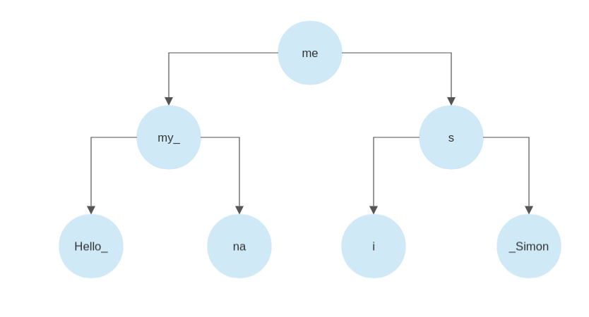

# PieceRope-ocaml Design

## Introduction

This data structure consists of two main components: a buffer represented as a Rope-like structure and a Piece Tree, just like a Piece Table but only with one buffer as we are storing all text in RAM in which case the distinction between the add and original bufer is pointless.

All algorithms here are described and implemented recursively (with Continuation Passing Style to avoid stack overflows).

## Buffer

The buffer is represented as a Rope-like structure on top of an AVL Tree. The buffer supports two operations: append and substring.

The difference between the buffer and normal ropes is that there is no distinction between concat and leaf nodes. Every node contains left/right subtree metadata and a string. The difference can be seen in the images below.

The second image is slightly misleading - each node is still annotated with the size of its left and right subtrees and instead of creaing a new node each time we append we concatenate the string we want to append to the rightmost node until (last node's string length + append string's length) is greater than some maximum limit (currently 1024). If we go over that limit, we create a new node for the append string and rebalance as recursion unwinds. 

Keeping the tree short (which the concatenation and lack of distinction between concat and leaf nodes helps us to do) keeps the structure performant.

This isn't the only way to represent the buffer - a plain string can be used (although you pay the cost of allocating and freeing up large objects) and VS Code uses an array of strings which is generally faster but mutable and non-functional (missing all of the benefits of immutability).

Using an array also means storing a number in each node in the Piece Tree about which index it points to in the array. This can fragment the Piece Tree compared to allowing a single piece to address the whole contents of the buffer. So, while VS Code's scheme can be made functional with a HAMT, I prefer this design.

### Operations - Append

1. Go to the rightmost node.
2. Is length of string we want to insert + length of rightmost node under a certain length?
3. If it is under, just concate the insert string to this node.
4. If it is over, create a new node with the insert string and rebalance.

### Operations - Substring

The substring operations are implemented in an unusual way because of OCaml's most performant method of concatenating strings - using the (::) cons operator to create a linked list of strings (which adds to the front of the list each time) and then calling String.concat to concatenate every string in the list.

The order imposed by this is reflected in the following traversal.

1. Is the current node in the substring range? If yes, recurse to the right node and then append the string at this node once we are done recursing. After that, recurse to the left.
2. Is the start of this node (= the end of the substring range) in range? If yes, get the relevant substring, recurse leftwards and then append the substring we got at this current node once leftwards recurse is done.
3. Is the end of this node (= the start of the substring range) in range? If yes, get substring, append it and recurse right.
4. If the substring range is in the middle of this node, we don't need to recurse anywhere else. So get the substring and return it.
5. If the substring range starts before our current index in the node, recurse left.
6. Else, recurse right.

## Piece Tree

The second part of the structure, the Piece Tree, is just like the second image above except, instead of storing a string, we store pointers to the buffer with a start and length property of a range of text to extract (this is the "Piece" in the "Piece Tree" or "Piece Table").

The kind of balanced binary tree used for the Piece Tree is important as some tree invariants are easier to maintain than others. For this reason, I chose AVL Trees which use the subtrees' height for the balancing scheme. 

There are some operations that are quite odd (one insert case means inserting two nodes in one operation and one delete case, instead of deleting from the tree, actually inserts a new node into the tree) and having a balancing algorithm that is the same for both insert and delete operations is helpful as we don't need to propogate this information, and AVL and Weight Balanced Trees are good for this task.

Description of some operations is omitted due to minimal differences with one of the buffer operations described above. 

(These are prepend, which is the same as buffer.append except reverse, append which is the same as for the buffer except that it merges with the rightmost piece if the rightmost piece was the last to be inserted into the tree, indexing, substring and line retrieval.)

Balancing is done after insertion and deletion operations but not mentioned.

### Operations - Insert

1. Are we at an empty node? Then create a new node at this place.
2. Are we trying to insert before the node/index we are currentl at? Then recurse leftwards.
3. Are we trying to insert after the current node/index? Then recurse rightwards.
4. Are we trying to insert at the same index this current node starts at? Then append the node to insert to the left subtree. (If it is understood that an in-order traversal rebuilds the original string, the logic used here makes sense.)
5. If we are trying to insert at the same index at the end of this node, and...
5. a. our last operation was inserting this node, then merge the insertion piece with the piece at this node - optimisation to avoid making tree larger than it needs to be.
5. b. otherwise, prepend the insert node to the start of the right subtree (same logic as 4.).
6. If none of the above cases, that means we need to split the node we are at in the middle. Once we calculate the length of each part of the split node, we append the left part to the end of the left subtree and prepend the right part to the start of the left subtree. Where the previous node was, we will place the node we want to insert.

### Operations - Delete

The delete operation checks for the same things the buffer.substring operation does (is this node in range, etc.) but some of the operations after we check for these cases are unusual and deserve mention.

1. Is the current node in the deletion range? Then recurse leftwards and then recurse rightwards. If the left subtree after recursion is empty, replace it with the right subtree or else call the AVL Tree split_max function on the left subtree and at this node place the value that function returns. (Details of that function not mentioned as we want to abstract from type of balanced tree in description.)
2. If the start of this node (= end of deletion range) is in range, then recalculate this piece's start and length values and recurse leftwards.
3. If the end of this node (= start of deletion range) is in range, recalculate this piece's start and length and recurse rightwards.
4. If the middle of this node is in the deletion range, create two pieces from this node with the middle part left out. You can either append the left part to the end of the left subtree or prepend the right part to the start of the right subtree (it doesn't matter). The other part should be placed at this node.
5. If the start of the deletion range is before this node, recurse leftwards.
6. Else, recurse rightwards.

## Misc. operations.

The structure described allows more operations than the ones mentioned. I will describe some of the more interesting ones.

### Operations - Find, find and replace

Fold is a kind of higher order function that is useful for implementing other functions on top of it. A fold for a binary tree performs an in-order traversal and applies a function at every node, threading an accumulator value (reduce is a special case of this).

This implementation has a function called `fold_match_indices` which performs an in order traversal of the tree, searches (like a needle in a haystack) for all instances of the first character in a find_string and then executes a function on each of these indices.

The fold_match_indices function is used to implement `find_matches` (the function we pass just uses the :: cons operator on each index to find all instances). 

It is also used to implement `find_and_replace` which is a little more involved. For that operation, we first calculate the length of the `find_string` and `replace_string` passed to this method and get the difference. Then on each iteration of fold_match_indices, we delete the length of `find_string` at this index (remember the tree is immutable) and we insert the node representing the `replace_string` into the tree at a certain index. The index we insert at is `accumulated_difference` (starts from 0 and grows by `length_difference` after each delete because the strings we want to find and replace are likely different lengths) + `length_difference`.

Searching by regex isn't something I personally use and so have not implemented (are there any users of this library that want it?) but [the developers who worked on Atom](https://news.ycombinator.com/item?id=15386155) used the partial match API on a Piece Table for this functionality which should work here too.

### Operations - Serialise, Deserialise

These operations allow persistent undo and redo after an application closes by saving the state of the Piece Rope to a file (JSON in this implementation).

(These serialise and deserialise operations wouldn't exist if the library didn't handle undo and redo by itself because it relies on the latest iteration of the buffer being compatible with the current Piece Tree and all those that came before or are after in the undo/redo stacks.)

This is done by first converting the piece_rope (a recursive discriminated union) to a more compact format for JSON to reduce storage space. This section is dedicated to the conversion algorithm.

The algorithm used to convert starts with a Weight Balanced Tree of Piece objects. We fold over each Piece Tree in the undo and redo stack and add each piece to the Weight Balanced Tree (this is fine as there are no duplicates). 

Once we've constructed a tree containing every Piece, we create a list of integers for our current Piece Tree. This is done by folding over the current Piece Tree and using the `rank` function on Weight Balanced Trees to find the unique index of that piece and using the :: cons operator to build a list of integers representing the Piece's unique index.

The same operation is done for the undo and redo stacks, except instead of a single list of integers, we create a list of a list of integers where each inner list represnts a single Piece Tree in the stack.

### Operations - Rebuild

The rebuild operation recreates the Piece Trees in the undo and redo stacks by replacing the buffer with a buffer that contains the text contents of the current Piece Tree. 

For each Piece Tree in the undo and redo stacks, we retrieve the text of each string (using the Piece Tree in combination with the old buffer) and search for the same string in the new buffer. 

If it is found, we rebuild that tree from an empty Piece Tree by appending (remember the append operation merges pieces when possible). Otherwise, we append the string to the new buffer before appending to the new Piece Tree.

The result of this is that the current Piece Tree contains just a single Piece, which is the optimal performance case for this data structure. It also has the effect of eliminating dead memory (the Piece Table/Tree structures always append to the buffers and never delete - when deleting, the collection of Pieces is changed) which was the original motivation for implementing this operation.

The Piece Rope structure doesn't differ that much from other Piece Trees like AbiWord's and VS Code's but I think the functional implementation and some operations (particularly the serialise and deserialise one - I haven't seen anyone else try to implement persistent undo and redo that way before) are new or should at least be better known. Hopefully this design document will be good learning material for others interested in the same problem space and some of those who aren't that interested still find this library useful.
